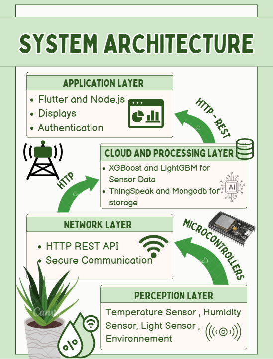

# BotaniAI 🌱  
AIoT-based Smart Indoor Plant Care System

## Overview 
BotaniAI is an AIoT-based smart indoor plant care system that monitors environmental conditions and predicts plant health using machine learning.

It integrates IoT sensors, cloud services, and an ensemble ML model to deliver real-time monitoring, plant health scoring, and actionable care recommendations for indoor plants.

## Problem Statement

Most existing plant monitoring solutions provide raw sensor data without meaningful interpretation.
Non-expert users struggle to understand environmental readings and often react too late to plant stress.

BotaniAI addresses this gap by transforming sensor data into intelligent, predictive insights using machine learning.
## Why This Project Matters
BotaniAI demonstrates an end-to-end AIoT system, covering embedded systems, cloud communication, machine learning, and frontend visualization.  
It reflects real-world constraints such as noisy sensor data, limited hardware resources, and the need for interpretable AI-driven recommendations.
## Key Features
- Real-time monitoring of temperature, humidity, soil moisture, and light intensity
- ESP32-based IoT data acquisition
- Cloud integration using ThingSpeak
- Machine learning-based plant health prediction (1–5 health score)
- Ensemble model using XGBoost and LightGBM
- REST API for AI inference (FastAPI)
- Cross-platform Flutter dashboard
## System Architecture
The system follows a layered AIoT architecture:
1. Perception Layer: ESP32 + sensors (DHT22, LDR, Soil Moisture)
2. Network Layer: WiFi + HTTP REST APIs
3. Cloud & Processing Layer: ThingSpeak, MongoDB, FastAPI, ML models
4. Application Layer: Flutter dashboard

## Hardware Components
- ESP32 Microcontroller
- DHT22 (Temperature & Humidity)
- LDR (Light Intensity)
- Soil Moisture Sensor
## Software Stack
- MicroPython (ESP32 firmware)
- ThingSpeak (IoT cloud platform)
- MongoDB (data storage)
- FastAPI (ML inference service)
- XGBoost + LightGBM (stacking ensemble)
- Flutter (frontend dashboard)
## Dashboard Preview

## Machine Learning Pipeline
- Dataset: Indoor Plant Health & Growth Dataset (Kaggle)
- Preprocessing:
  - Label Encoding
  - SMOTEENN for class balancing
  - Gaussian noise augmentation
  - Feature standardization
- Model:
  - Stacking ensemble (XGBoost + LightGBM)
- Performance:
  - Accuracy: 96%
  - Macro F1-score: 0.95
## How the System Works
1. Sensors collect environmental data
2. ESP32 sends data to ThingSpeak via HTTP
3. Backend stores and processes data
4. AI model predicts plant health status
5. Dashboard visualizes readings and recommendations
## Project Status
✔ Fully implemented prototype  
✔ Simulated using Wokwi  
✔ ML model trained and evaluated  
## Limitations
- Indoor use only
- Requires internet connectivity
- No automated actuation (watering/light control)
## Future Improvements
- Customized recommendations
- Automated irrigation and lighting control
- Edge ML inference on ESP32
- Support for additional sensors
- Mobile notifications
# Authors
Douaa Amani Benharroud  
Sara Roumaissa Benhabssa
# License
This project is licensed under the MIT License.
